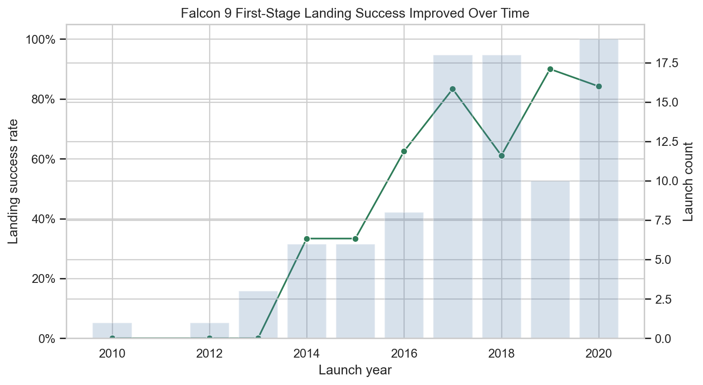
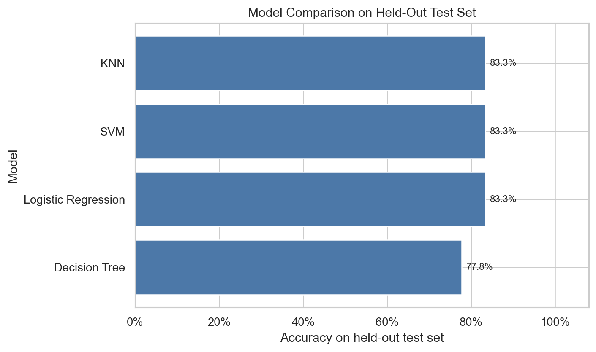
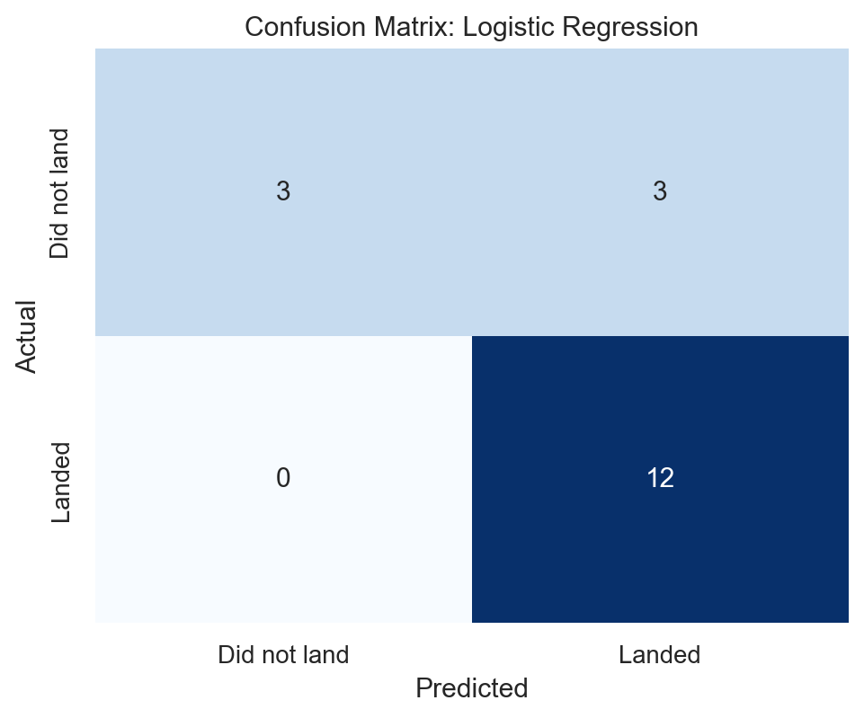

# SpaceX Falcon 9 Landing Success Prediction

An end-to-end applied data science project that predicts whether a SpaceX Falcon 9 first stage will land successfully. The project covers data collection, wrangling, exploratory analysis, geospatial context, and machine learning model comparison.

## Why This Project Matters

Falcon 9 first-stage recovery is central to launch cost reduction. Predicting landing success helps frame operational risk and identify launch characteristics associated with successful recovery.

## Portfolio Summary

- Built a complete data science workflow from source data through model evaluation.
- Analyzed 90 Falcon 9 launch records from 2010-06-04 through 2020-11-05.
- Created a binary target where `1` means the first stage landed successfully and `0` means it did not.
- Generated portfolio-ready figures for trend, site, orbit, payload, model comparison, and error analysis.
- Compared logistic regression, SVM, decision tree, and KNN classifiers using a held-out test set.
- Selected logistic regression as the primary model because it tied for best test accuracy while remaining interpretable.

## Key Results

The cleaned final evaluation uses local CSV snapshots and a train/test split with preprocessing fit only on the training data.

| Model | Best CV Accuracy | Test Accuracy |
|---|---:|---:|
| Logistic Regression | 0.835 | 0.833 |
| SVM | 0.877 | 0.833 |
| KNN | 0.864 | 0.833 |
| Decision Tree | 0.863 | 0.778 |

Selected model: **Logistic Regression**

Held-out test accuracy: **83.3%**

Important caveat: the test set contains only 18 rows, so the result should be interpreted as a portfolio demonstration rather than a production launch-risk model.

## Featured Figures







## Repository Structure

```text
.
├── README.md
├── requirements.txt
├── data/
│   ├── README.md
│   └── processed/
│       ├── dataset_part_1.csv
│       ├── dataset_part_2.csv
│       └── dataset_part_3.csv
├── figures/
│   ├── confusion_matrix_best_model.png
│   ├── landing_success_trend_by_year.png
│   ├── logistic_regression_top_coefficients.png
│   ├── model_comparison_accuracy.png
│   ├── payload_mass_by_outcome.png
│   ├── success_rate_by_launch_site.png
│   └── success_rate_by_orbit.png
├── notebooks/
│   ├── 01_web_scraping_data_collection.ipynb
│   ├── 02_data_wrangling.ipynb
│   ├── 03_launch_site_location_analysis.ipynb
│   ├── 04_machine_learning_prediction.ipynb
│   └── 05_final_summary_portfolio.ipynb
└── reports/
    ├── final_report.md
    ├── model_results.csv
    └── summary_metrics.json
```

## Notebooks

- `01_web_scraping_data_collection.ipynb`: original data collection notebook.
- `02_data_wrangling.ipynb`: original cleaning and target creation notebook.
- `03_launch_site_location_analysis.ipynb`: original launch-site mapping notebook.
- `04_machine_learning_prediction.ipynb`: original machine learning lab notebook.
- `05_final_summary_portfolio.ipynb`: clean recruiter-facing summary notebook.

The original notebooks are preserved. The final summary notebook is the recommended entry point for review.

## How To Run

Create an environment and install dependencies:

```bash
pip install -r requirements.txt
```

Open the portfolio notebook:

```bash
jupyter notebook notebooks/05_final_summary_portfolio.ipynb
```

The final notebook uses local data in `data/processed/` and local images in `figures/`.

## Limitations

- The dataset is small: 90 launches total.
- The held-out test set has 18 rows.
- Some orbit categories have very few examples.
- The model is intended for portfolio analysis, not operational launch decision-making.
